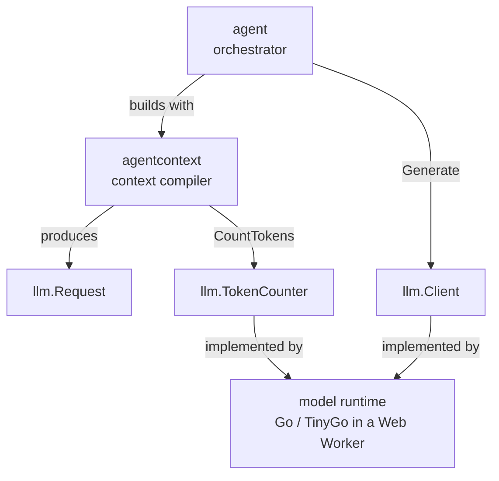

# Architecture — `webtyp/llm`

## What this is

`llm` is the **contract** between code that asks a language model something and the code
that runs the model. It holds two interfaces and the value types that cross between them,
and nothing else.

You run into it when you write an orchestrator (like `webtyp/agent`), a context compiler
(like `webtyp/agentcontext`), or a model runtime. The first two build an `llm.Request`. The
runtime implements `llm.Client` and answers with an `llm.Response`.

It exists so that neither side imports the other. The agent does not know which model runs,
and a model runtime does not import the orchestrator.

## The three interfaces

| Interface | Implemented by | Used by |
|---|---|---|
| `Client.Generate(ctx, Request) (Response, error)` | a model runtime | `agent` (reasoning, reflection, summarization) |
| `TokenCounter.CountTokens(text) int` | the same runtime, with its own tokenizer | `agentcontext` (budgets), `agent` (per-message counts) |
| `Streamer.GenerateStream(ctx, Request, onText) (Response, error)` | a runtime that can stream | the version-2 voice loop, to start speaking before the answer ends |
| `Decider.Decide(ctx, Question) (Decision, error)` | a runtime that can read its own probabilities (in the browser, `qwen`; on the developer machine, `agenteval` over `llama-server`) | `agent`'s critic; later a tool router |

They are separate interfaces (interface segregation). Code that only budgets a prompt asks for
a `TokenCounter` and cannot call the model by accident, and a runtime that cannot stream does
not have to fake `Streamer`.

## Where the model runs

`webtyp` runs models **inside the browser**, in Go compiled to WebAssembly with TinyGo, the
same way `webtyp/embed` already runs the embedding model. The runtime that implements
`Client` lives in its own repository. It is not decided yet; see the open decisions in the
[ecosystem master plan](https://github.com/webtyp/agent/blob/main/docs/AGENT_ECOSYSTEM_MASTER_PLAN.md).
This contract does not change with that choice.

## Design notes

- **The chat template is the runtime's job.** A local model reads text formatted with its
  own template, such as `<|im_start|>user …`. The runtime renders `Request` into that
  template. The contract stays structured so the same request works for any model.
- **`System` is a field, not a message.** It holds what stays the same for the whole
  conversation. That keeps it at the front of every request, where a runtime can reuse the
  work it already did on it (prefix caching).

## Research

- [Small browser LLMs](SMALL_LLM_BROWSER_MODEL.md): candidate models under 1B parameters for
  tool calling in Spanish, and grammar-constrained decoding.
- [Efficient SLMs](EFFICIENT_SLM.md): background on small models and quantization (server-side
  models, kept for reference).
